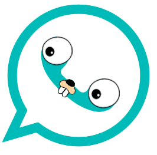

#  GoChat

A high-performance, real-time messaging application featuring a Go backend and a React/Vite frontend, structured as a monorepo.

🌐 **Live Demo:** [https://www.trygochat.tech](https://www.trygochat.tech)

> 💡 **Note:** The backend is fully robust and deployed. The frontend is actively being developed and refined, but is fully functional and ready to be tested using the live link above!

---

## Description

**GoChat** is a real-time chat application designed to provide reliable, low-latency communication across web clients. Built as a monorepo, it pairs an asynchronous Go backend with a modern React and Vite frontend interface, wrapped in a sleek, Telegram-style two-column layout.

### Tech Stack & Core Features

- **Go Backend:** Built using Go (Golang) utilizing standard `net/http` routing and `justinas/alice` for clean middleware chaining. Designed for optimal performance, simplicity, and concurrency.
- **Database Layer:** **PostgreSQL** handles persistent relational data, utilizing **sqlc** for compiling SQL into fast, type-safe Go code.
- **Real-Time Engine:** **WebSockets** enable instant, bi-directional message transmission, live incoming chat requests, and real-time presence/typing indicators.
- **Message Broker:** Integrated **RabbitMQ** for reliable pub/sub message delivery, event deduplication, and asynchronous event handling.
- **Robust Authentication:** Complete security layer supporting **JWT (JSON Web Tokens)**, standard **Email/Password** authentication, and **GitHub OAuth** integration (with automatic nickname collision handling).
- **Social Graph & Privacy:** Full user relationship system allowing users to search by nickname, send chat requests, and accept, reject, or block users.
- **Modern Frontend:** A **React** web app built with **Vite**, featuring infinite scrolling for message history and dynamic real-time state updates.
- **Containerization:** The backend is containerized using a multi-stage **Docker** build (utilizing `distroless` for the final image) for a secure, minimal runtime footprint.

---

## Motivation

The primary motivation behind **GoChat** is to explore and construct a highly scalable, real-time messaging system leveraging Go's native concurrency models (goroutines and channels). It also serves as a practical implementation of end-to-end modern CI/CD deployment pipelines and cloud infrastructure practices on Microsoft Azure.

---

## Quick Start

Follow these steps to set up and run GoChat in your local development environment.

### Prerequisites

- [Go](https://go.dev/) (v1.20+ recommended) or [Docker](https://www.docker.com/)
- [Node.js](https://nodejs.org/) & `npm`
- **PostgreSQL** (Running locally or via Docker)
- **RabbitMQ** (Running locally or via Docker)

### 1. Clone the Repository

```bash
git clone https://github.com/sergioferg/gochat.git
cd gochat
```

### 2. Start the Go Backend

You can run the backend directly using Go, or build and run it using Docker. _(Ensure your `.env` file is populated with your Postgres and RabbitMQ connection strings)._

#### Option A: Running with Go

```bash
go run main.go
```

#### Option B: Running with Docker

```bash
docker build -t gochat-backend .
docker run -p 8080:8080 --env-file .env gochat-backend
```

The Go backend server will start listening on port `8080` for REST and WebSocket connections.

### 3. Start the Vite Frontend

In a separate terminal, navigate to the frontend directory, install dependencies, and launch the Vite development server:

```bash
cd frontend
npm install
npm run dev
```

---

## Usage

### Architecture & Deployment Strategy

GoChat is architected as a decoupled monorepo, with separate cloud deployment targets for backend and frontend services:

- **Backend Deployment:** The containerized backend is deployed on **Azure App Service** behind a custom domain with automated SSL encryption via **App Service Managed Certificates**.
- **Frontend Deployment:** Deployed using **Azure Static Web Apps** with automated **GitHub Actions** CI/CD pipelines and attached to its own custom root domain (`trygochat.tech`).
- **Communication Protocol:** The frontend interacts with the Go backend via **CORS-enabled RESTful endpoints** for user management and authentication, and establishes long-lived **WebSocket** connections for instant message routing.

### API Documentation

For full details on authentication, REST endpoints, request/response bodies, and real-time WebSocket event formats, refer to the API documentation:

- 📖 **[API Reference Guide](docs/API.md)**
- 📄 **[OpenAPI 3.0 Specification](docs/openapi.yaml)**

---

## Contributing

Contributions, issues, and feature requests are welcome! Since the frontend is currently under active development, feedback and pull requests are especially helpful.

1. Fork the project repository.
2. Create a feature branch (`git checkout -b feature/my-new-feature`).
3. Commit your changes (`git commit -m 'Add feature/my-new-feature'`).
4. Push to your branch (`git push origin feature/my-new-feature`).
5. Open a Pull Request or report an Issue.
